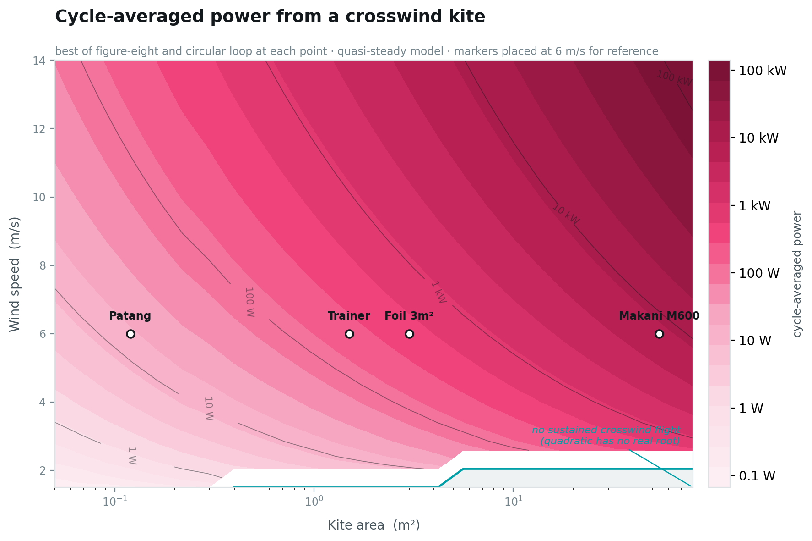
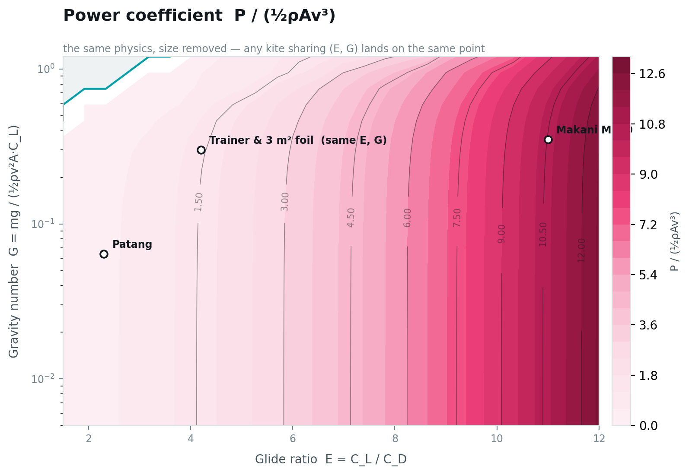

# Crosswind Kite Power at 0.12 m²

**How far do published airborne-wind-energy models hold when you shrink the kite by five orders of magnitude?**

Airborne wind energy works because a kite flying *across* the wind makes its own headwind, so
tether tension multiplies by roughly the square of the kite's glide ratio. Miles Loyd wrote the
governing result down in 1980, and the field has validated it at 20 kW and above.

Nobody has checked it at 0.12 m² — an Indian festival kite — because there is no money in it.
This project does that, and reports where the published models hold and where they break.

**→ [Interactive model](https://1101-hub.github.io/crosswind-kite-power/)**

---

## What this is, honestly

This is **replication at an untested scale**, not new physics. The gravity effects, the tether-drag
lumping, the figure-eight-versus-circle question, and the optimal trajectory problem are all
established in the literature — three separate literature searches confirmed it.

What is genuinely thin is *measurement*. Published small-scale campaigns report
**five cycles** and **53 seconds** of flight data, because their hardware is expensive and their
field time is scarce. A student with a ₹700 load cell and a season of weekends can do
substantially better than that, and can sweep parameters that expensive rigs cannot afford to.

## The seven predictions

Every number is computed from the model **before any measurement is taken** and written to a dated
file that does not get edited. A model tuned after seeing the data can fit anything; one that
commits in advance can be wrong.

| | Prediction | Falsified if |
|---|---|---|
| **P1** | `E = (T sin β + W) / (T cos β)` from a parked kite, constant across wind speeds | E drifts with wind speed |
| **P2** | Tension multiplies by about `E² cos²θ` once figure-eights begin | No jump, or off by >2× |
| **P3** | Two tension peaks per loop, at the centre crossings | One peak, or peaks at the edges |
| **P4** | A fixed fraction of the Loyd ceiling is achieved | Measured far below model |
| **P5** | Power peaks at an intermediate tether length | Rises monotonically with length |
| **P6** | Below a critical wind speed the flight-speed quadratic has no real root and the kite cannot climb | Loops fly well below it |
| **P7** | Tether drag lumps as `C_Dt · d · L / (4A)` | E is flat with tether length |

Current values: [`predictions_patang_2026-08-06.txt`](predictions_patang_2026-08-06.txt)

**P1 is the linchpin.** It measures glide ratio from a load cell and a phone inclinometer alone —
no anemometer, no assumed coefficients, no wind tunnel. Since power scales as `E²`, everything
downstream depends on it.

**P6 is the sharpest.** Flight speed solves

```
v_a² − E(v_w cos θ − v_r)·v_a + mg·climb/(½ρAC_D) = 0
```

and when the discriminant goes negative there is no real root — the kite physically cannot complete
the climb and falls out of the sky. An algebraic condition on a discriminant, predicting something
you can watch happen in a field.

## The model

Quasi-steady point mass constrained to a sphere of radius equal to the tether length, so the kite
has two degrees of freedom: azimuth `φ` and elevation `β`. Power scales as `cos³θ` where
`cos θ = cos β · cos φ`.

Included: gravity (via the quadratic above), tether drag lumped as `C_Dt·d·L/(4A)`, the reel-in
cost of the pumping cycle, and a turning-radius floor of five wingspans.

**Not** included: turbulence, unsteady aerodynamics, canopy deformation, control losses. Real power
should therefore land *below* these numbers, and the size of that gap is the quantity worth
measuring.

### Two implementation details worth knowing

**Spectral derivatives.** Path derivatives come from FFT differentiation, which is *exact* for
band-limited periodic functions — and the paths are finite Fourier series, so they are band-limited
by construction. The loop integral uses a plain uniform trapezoid sum for the same reason: for a
smooth periodic integrand over a full period, the trapezoid rule converges exponentially, and
Simpson's rule is worse.

**The turning-radius floor is not cosmetic.** Without it the optimiser finds a degenerate solution:
shrink the figure-eight to a point while still collecting the crosswind speed bonus, which describes
a kite that is not actually flying crosswind. The floor of five wingspans follows Eijkelhof et al.
(WES 2024).

## The optimiser

Three stages, and the algorithm choices follow from one fact: **the objective has a cliff in it.**
Where the discriminant goes negative, power is undefined. That rules out gradient methods, which
compute garbage finite-difference gradients across the cliff.

1. **Coarse grid sweep** — always first. Shows the whole shape of the objective and catches multiple
   optima before a local method is fooled.
2. **Nelder–Mead** — derivative-free, so the cliff does not break it.
3. **Differential evolution** on a general Fourier path — global, derivative-free, 15 dimensions.

Box constraints are *reparameterised* away rather than enforced, so they cannot be violated. The
path-dependent ones (tension limit, turn radius) use exterior penalties, which turn the cliff into a
slope the optimiser can walk down.

### A correctness test that caught a real bug

A Lissajous figure-eight is the special case of the Fourier path with `a₁ = sweep`, `c₂ = rise`, and
everything else zero. So the Fourier optimum **must** be at least as good as the Lissajous optimum —
if it ever isn't, the optimiser is broken.

It wasn't, on the first run. The Fourier parameterisation was dividing elevation coefficients by the
harmonic count, capping `rise` at 4° when the optimum needs 12°. **The Lissajous path was not
reachable inside the supposedly more general search space.** Fixed, round-trip tested, and the
global search is now warm-started from the Lissajous optimum so nesting holds by construction.

### First result

Given fifteen free coefficients and no constraint on shape, the optimiser returns

```
a = [44.3, 0.1, -0.2]     c = [0.0, 10.8, 0.1]     d ≈ 0
```

Pure first harmonic in azimuth, pure second harmonic in elevation — **a Lissajous figure-eight**,
with everything else set to zero. The classical figure-eight is within ~5% of optimal, and that 5%
comes from retuning elevation and reel-out speed, not from a better shape.

## The design chart



Power from a crosswind kite across five orders of magnitude, from a 0.12 m² festival patang to
Makani's 54 m² M600. At every point the trajectory is optimised — both a figure-eight and a circular
loop are tried, and the better one wins. The teal line at the bottom is the **no-flight boundary**,
where the flight-speed quadratic loses its real root and the kite physically cannot sustain the
climb.

Two things fell out of building this that were not obvious.

**A figure-eight cannot fly at large scale.** The five-wingspan turning limit grows as √area, but the
tightest turn a Lissajous figure-eight can hold is only about **0.18 × tether length** — the reversal
at each azimuth extreme is a near-cusp. A circle never reverses, so it holds about **0.22 ×**. Past a
certain size the eight is *geometrically impossible* and only the circle remains feasible.

An earlier version of this chart showed nothing above 1 m² able to fly. That turned out not to be a
bug in the physics but the model correctly reporting an impossible configuration: the tether length
was being scaled as `A^0.16` while the turn requirement grew as `√A`. Tether length has to scale with
wingspan.

**And the model says circles beat figure-eights everywhere on pure power.** That is not a
contradiction of practice — it's a statement about what the model contains. There is no penalty here
for winding the tether up, and tether twist is exactly why the field flies figure-eights. The
advantage of the eight is operational, not aerodynamic.

### With size removed



The same physics, non-dimensionalised. Everything now depends on just two numbers: the glide ratio
`E = C_L/C_D`, and the gravity number `G = mg/(½ρv²A·C_L)` — how heavy the kite is relative to the
lift it can make. Any two kites sharing `(E, G)` land on the same point regardless of size, which is
what licenses a 0.12 m² patang to say anything at all about a 54 m² Makani wing.

The 1.5 m² trainer and the 3 m² foil sit on **exactly the same point** despite one being twice the
area. That is the collapse working.

Two readings worth taking from it:

- **`E` dominates.** The contours run almost vertically — power coefficient tracks glide ratio and
  barely notices gravity until `G` exceeds roughly 0.5. This is why P1 is the gate: get `E` wrong
  and nothing else matters.
- **Gravity only bites in the top-left.** High `G` *and* low `E` together produce the no-flight
  region. A patang survives light wind not despite being flimsy but because of it — at 12 grams its
  `G` is 0.06, an order of magnitude below a power foil's.

## Uncertainty, and why P1 must come first

A prediction of "2.32 W" cannot be wrong — any measurement differs from it, so "close enough"
becomes a judgement call. A prediction of "1.0 to 4.9 W" *can* be wrong. Bands are what make
P1–P7 testable rather than decorative, so every input is drawn from its distribution a few thousand
times and pushed through the model.

Two things fell out that were not obvious in advance.

**The intuitive error analysis is wrong.** It is tempting to say that P2, being a *ratio* of
crosswind to static tension, is better determined than either part — a high `C_L` raises both, so it
cancels. It doesn't:

```
static tension     ~ C_L
crosswind tension  ~ C_L · E²  =  C_L³ / C_D²
ratio              ~ C_L² / C_D²
```

Nothing cancels. The ratio depends on the *square* of an already-uncertain glide ratio, making it
**more** sensitive to the coefficients than either tension alone. The real argument for Monte Carlo
isn't that it handles correlations better than adding in quadrature — it's that it stops you
reasoning your way to a confident wrong answer.

**The experiment has a mandatory order.** One-at-a-time sensitivity says `C_L` (231%), `C_D` (210%)
and wind speed (193%) dominate everything else by an order of magnitude. Since `C_L` and `C_D` are
currently *estimates*, the predictions are untestable until they're measured:

| Scenario | Predicted power at 5 m/s | Band width |
|---|---|---|
| Today, coefficients estimated | 2.30 W  `[0.17 – 11.89]` | ×68 |
| After P1 has measured E | 2.33 W  `[1.04 – 4.85]` | ×5 |

One afternoon of parked-kite measurements tightens every downstream prediction by **13×**. So P1
isn't merely the first prediction — it is the gate. Fly it, regenerate the bands with the measured
coefficients, and only then attempt P2 or P4.

```bash
python uncertainty.py            # bands + sensitivity + the scenario comparison
```

## Layout

```
model/
  kite.py          physics: flight-speed quadratic, tether drag, cycle power, Loyd ceiling
  optimize.py      grid sweep -> Nelder-Mead -> differential evolution, with the nesting test
  predictions.py   generates the dated pre-registration document
  uncertainty.py   Monte Carlo bands, sensitivity, and the scenario comparison
docs/
  index.html       the interactive model (served by GitHub Pages)
```

```bash
pip install numpy scipy matplotlib
cd model
python predictions.py            # regenerate predictions for the patang
python predictions.py trainer    # ... or for a 1.5 m² trainer foil
```

Measured your kite? Edit `PATANG` in `model/predictions.py` and regenerate — everything downstream
updates. Do it **before** flying, so the pre-registration stays honest.

## Hardware

| Part | Spec | Approx. |
|---|---|---|
| Load cell | 1 kg straight bar (static pull is 39–262 g) | ₹250 |
| Amplifier | HX711 24-bit | ₹120 |
| Logger | ESP32 or Arduino Nano + microSD | ₹400 |
| Line angle | phone inclinometer, or a BNO085 IMU at the fairlead | ₹0–700 |

**Line:** plain cotton or polyester only. **Never manja** — glass-coated line maims birds and people
every year, and it also gives you an unknown line diameter, which the tether-drag term needs.

## References

- Loyd, M. (1980). Crosswind Kite Power. *J. Energy* 4(3), 106–111. — [PDF](http://homes.esat.kuleuven.be/~highwind/wp-content/uploads/2011/07/Loyd1980.pdf)
- van der Vlugt et al. Quasi-Steady Model of a Pumping Kite Power System. — [arXiv:1705.04133](https://arxiv.org/abs/1705.04133)
- Argatov, Rautakorpi & Silvennoinen (2009). Estimation of the mechanical energy output of the kite wind generator. *Renewable Energy* 34.
- Optimal flight pattern debate: circular or figure of eight? — [WES 11, 1287 (2026)](https://wes.copernicus.org/articles/11/1287/2026/)
- A small-scale and autonomous testbed for three-line delta kites. — [WES 10, 1153 (2025)](https://wes.copernicus.org/articles/10/1153/2025/)
- Aerodynamic characterization of a soft kite by in situ flow measurement. — [WES 4, 1 (2019)](https://wes.copernicus.org/articles/4/1/2019/)
- Kite as a sensor: wind and state estimation in tethered flying systems. — [WES 10, 2161 (2025)](https://wes.copernicus.org/articles/10/2161/2025/)
- Makani (Alphabet) open-source release — [code](https://github.com/google/makani), [The Energy Kite Report](https://x.company/collection/makani/), flight logs as a BigQuery public dataset.

## Safety

A 3 m² power kite flying crosswind pulls several hundred newtons — enough to drag or lift a person.
A 0.12 m² patang pulls under half a kilogram and is not dangerous, which is one good reason to start
there. Fly in open ground with nobody downwind, keep a knife or quick-release at the anchor, never
wrap line around your hands, and check local airspace rules.

## Licence

Code MIT. Data and documentation CC BY 4.0.
